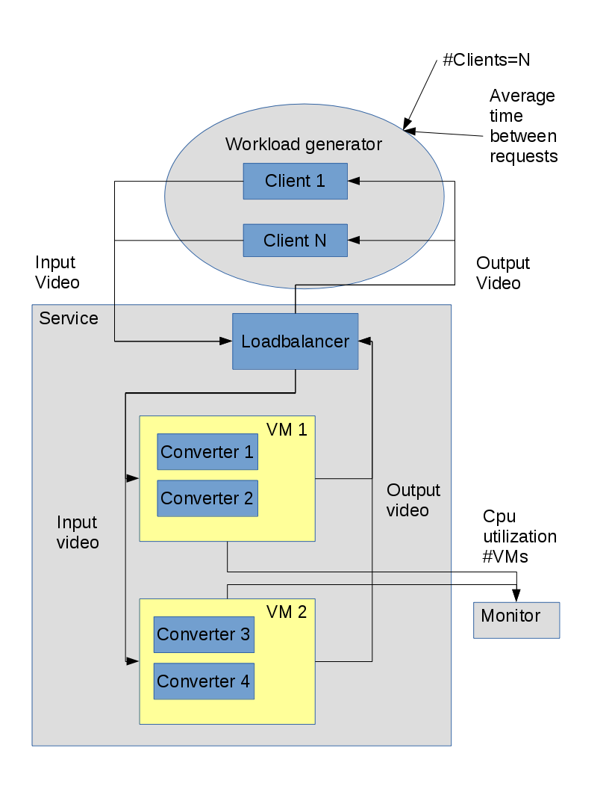

# architecture of the application

The service will work like the AWS lambda service, where images are resized.

# Components

## Workload generator

* The workload generator **MUST** submit video conversion requests to the service and measure values such as response time and queue length.
* The workload **MUST** be generated in a closed system model 3 with two parameters: number of client converters, average time between conversion requests.

### - Technology Stack
### - Exposed interfaces

## Service

* The service **MUST** take input videos and convert them to an output video.
* The service **MUST** be scalable. It MUST be able to scale up or down depending on its load, measured as the number of videos pending conversion. The exact choice of scale up and scale down strategy is left to you. However, please note that, due to oversubscription, the cloud environment you are provided with does not guarantee that adding one VM will lead to an overall increase in performance, nor that your VMs will have the same performance over time. Your scale up/down algorithm **MUST** handle such situations correctly.
* The service **MUST** be robust​. It **MUST** be able to withstand some common failures of the IaaS cloud, such as VMs being killed.

### - Technology Stack
* Python Flask - for implementing REST servers
* Java Jersey - to implement REST clients and servers
* Mencoder - for video conversion
### - Exposed interfaces

## Monitoring tool

* The monitoring tool **MUST** interact with the IaaS cloud and periodically gather information such as number of VMs and CPU utilization of VMs.
* The tool’s output **MUST** be optimized for plotting, e.g., CSV.

### - Technology Stack
* nginx -  for load balacing
### - Exposed interfaces

# System overview

From what I interpreted the requirements, this is a depiction of the intended system.

# Exposed interfaces

# Definitions

* **Think time**: ?
* **Closed system**: how does it take input?

## Closed system

* In a  closed system model, it is assumed that there is some fixed number of users, who use the system forever.
* This number of users is typically called the multiprogramming level (MPL) and denoted by N.
* Each of these N users repeats these 2 steps, indefinitely: (a) submit a job, (b) receive the response and then “think” for some amountof time.
* a new request is only triggered by the completion of a previous request.
* At all time there are some numbers of thinkers and users running the system.
